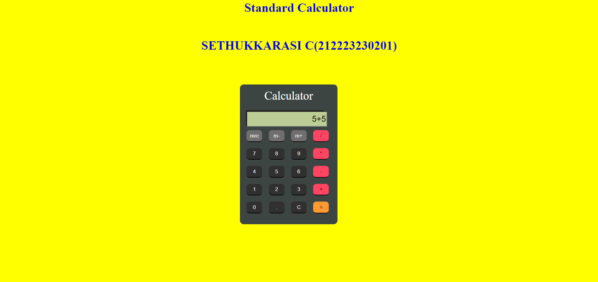

# Ex.08 Design of a Standard Calculator
## Date:25.04.2024

## AIM:
To design a web application for a standard calculator with minimum five operations.

## DESIGN STEPS:

### Step 1:
Clone the github repository and create Django admin interface.

### Step 2:
Change settings.py file to allow request from all hosts.

### Step 3:
Use CSS for creating attractive colors.

### Step 4:
Write JavaScript program for implementing five different operations.

### Step 5:
Validate the HTML and CSS code.

### Step 6:
Publish the website in the given URL.

## PROGRAM :
```
<!DOCTYPE html>
<html lang="en">

<head>
    <meta charset="UTF-8">
    <meta name="viewport" content="width=device-width, initial-scale=1.0">
    <title>Calculator</title>
    <style>
        body {
            background-color: yellow;
        }

        .box {
            background-color: #3d4543;
            height: 360px;
            width: 250px;
            border-radius: 10px;
            position: relative;
            top: 80px;
            left: 40%;
        }

        .display {
            background-color: #222;
            width: 200px;
            position: relative;
            left: 15px;
            top: 20px;
            height: 40px;
        }

        .display input {
            position: relative;
            left: 2px;
            top: 2px;
            height: 35px;
            color: black;
            width: 200px;
            background-color: #bccd95;
            font-size: 21px;
            text-align: right;
        }

        .keys {
            position: relative;
            top: 15px;
        }

        .button {
            width: 40px;
            height: 30px;
            border: none;
            border-radius: 8px;
            margin-left: 17px;
            cursor: pointer;
            border-top: 2px solid transparent;
        }

        .button.gray {
            color: white;
            background-color: #6f6f6f;
            border-bottom: black 2px solid;
            border-top: 2px #6f6f6f solid;
        }

        .button.pink {
            color: black;
            background-color: #ff4561;
            border-bottom: black 2px solid;
        }

        .button.black {
            color: white;
            background-color: #303030;
            border-bottom: black 2px solid;
            border-top: 2px #303030 solid;
        }

        .button.orange {
            color: black;
            background-color: #FF9933;
            border-bottom: black 2px solid;
            border-top: 2px #FF9933 solid;
        }

        .gray:active {
            border-top: black 2px solid;
            border-bottom: 2px #6f6f6f solid;
        }

        .pink:active {
            border-top: black 2px solid;
            border-bottom: #ff4561 2px solid;
        }

        .black:active {
            border-top: black 2px solid;
            border-bottom: #303030 2px solid;
        }

        .orange:active {
            border-top: black 2px solid;
            border-bottom: #FF9933 2px solid;
        }

        p {
            line-height: 10px;
        }

        .head {
            font-size: 30px;
            text-align: center;
            padding-top: 12px;
            color: white;
        }

        @keyframes textAnimation2 {
            0% {
                transform: translateY(0);
            }

            50% {
                transform: translateY(-20px);
            }

            100% {
                transform: translateY(0);
            }
        }

        @keyframes textAnimation {
            0% {
                transform: translateY(0);
            }

            50% {
                transform: translateY(20px);
            }

            100% {
                transform: translateY(0);
            }
        }

        .animated-text {
            animation: textAnimation 2s infinite;
            text-align: center;
            color: blue;
        }

        .animated-text2 {
            animation: textAnimation2 2s infinite;
            text-align: center;
            color: blue;
        }
    </style>
</head>

<body>
    <script>
        function c(val) {
            document.getElementById("d").value = val;
        }
        function v(val) {
            document.getElementById("d").value += val;
        }
        function e() {
            try {
                c(eval(document.getElementById("d").value))
            }
            catch (e) {
                c('Error')
            }
        }
    </script>
    <h1 class="animated-text2">Standard Calculator</h1>
    <h1 class="animated-text">SETHUKKARASI C(212223230201)</h1>
    <div class="box">
        <div class="head">Calculator</div>
        <div class="display"><input type="text" readonly size="18" id="d"></div>
        <div class="keys">
            <p><input type="button" class="button gray" value="mrc" onclick='c("Created....................")'><input
                    type="button" class="button gray" value="m-" onclick='c("...............by............")'><input
                    type="button" class="button gray" value="m+" onclick='c(".....................Anoop")'><input
                    type="button" class="button pink" value="/" onclick='v("/")'></p>
            <p><input type="button" class="button black" value="7" onclick='v("7")'><input type="button"
                    class="button black" value="8" onclick='v("8")'><input type="button" class="button black" value="9"
                    onclick='v("9")'><input type="button" class="button pink" value="*" onclick='v("*")'></p>
            <p><input type="button" class="button black" value="4" onclick='v("4")'><input type="button"
                    class="button black" value="5" onclick='v("5")'><input type="button" class="button black" value="6"
                    onclick='v("6")'><input type="button" class="button pink" value="-" onclick='v("-")'></p>
            <p><input type="button" class="button black" value="1" onclick='v("1")'><input type="button"
                    class="button black" value="2" onclick='v("2")'><input type="button" class="button black" value="3"
                    onclick='v("3")'><input type="button" class="button pink" value="+" onclick='v("+")'></p>
            <p><input type="button" class="button black" value="0" onclick='v("0")'><input type="button"
                    class="button black" value="." onclick='v(".")'><input type="button" class="button black" value="C"
                    onclick='c("")'><input type="button" class="button orange" value="=" onclick='e()'></p>
        </div>
    </div>
</body>

</html>
```

## OUTPUT:




## RESULT:
The program for designing a standard calculator using HTML and CSS is executed successfully.
